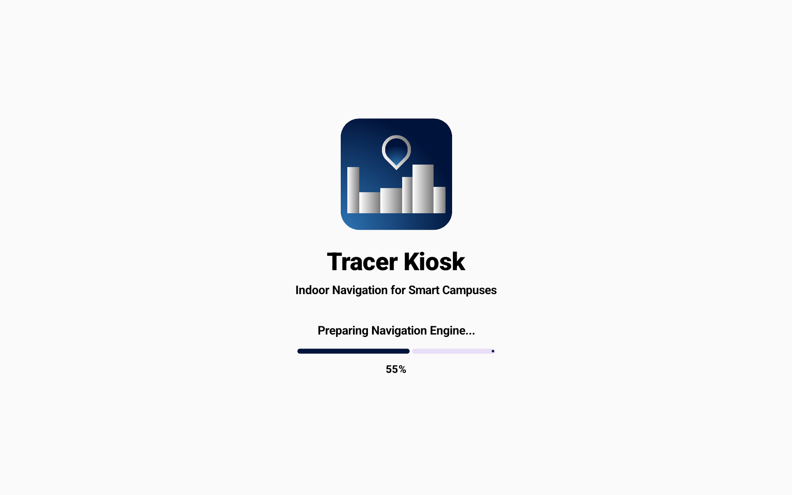
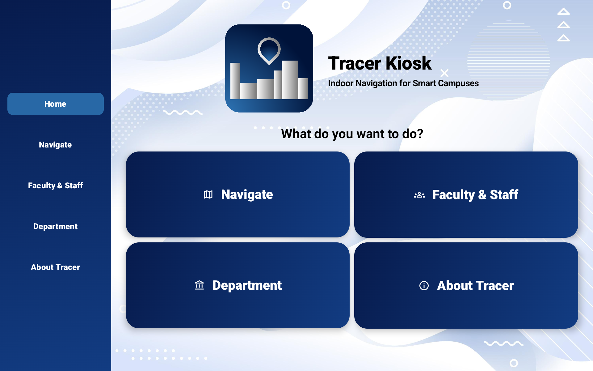
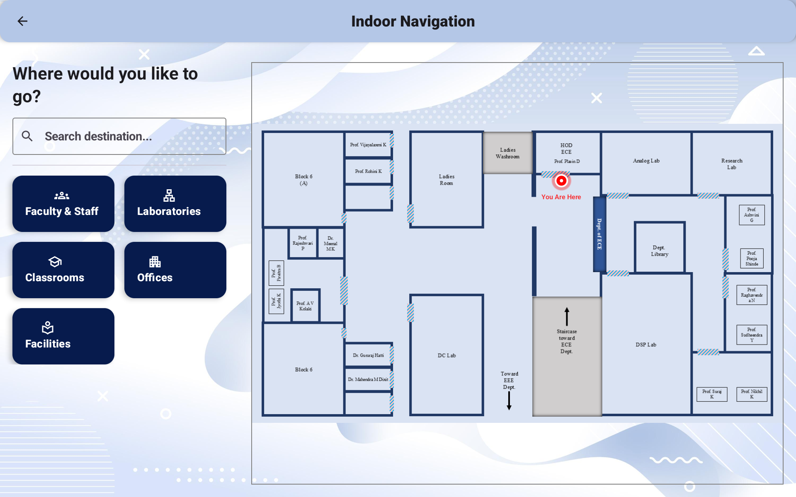
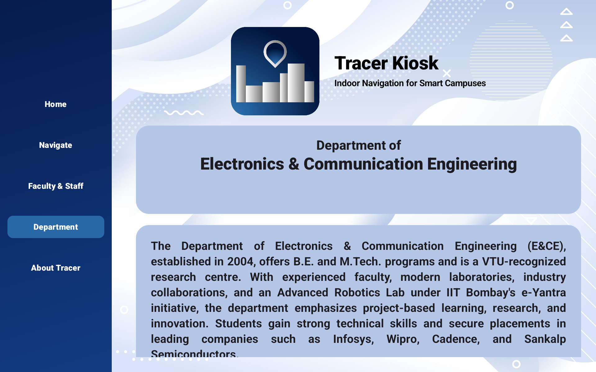
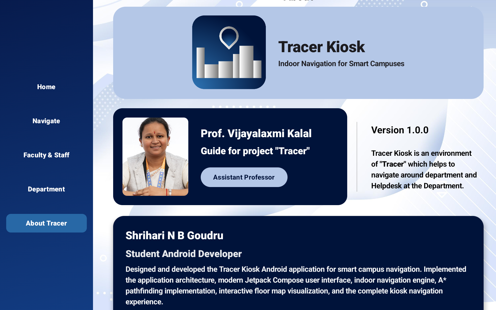

<p align="center">
  
</p>

<h1 align="center">Tracer Kiosk</h1>

<p align="center">
  Smart Information & Indoor Navigation Kiosk for Android Tablets
</p>

<p align="center">
  
  
  
  
  
</p>

---

# 📍 Tracer Kiosk

**Tracer Kiosk** is an Android tablet application developed as part of the **Tracer Smart Campus Navigation System**.

Designed for installation at the entrance of a department or campus building, the kiosk enables visitors to quickly browse faculty information, explore department facilities, search destinations, and receive indoor navigation guidance through an intuitive touch-friendly interface.

Unlike a personal mobile application, Tracer Kiosk serves as a **fixed digital information terminal**, providing visitors with fast access to campus information and indoor wayfinding.

> **Note**
>
> This repository contains only the **Tracer Kiosk** application.
> The BLE scanner, RSSI fingerprint collection, indoor localization engine, and machine learning modules are developed separately as part of the overall **Tracer** ecosystem.

---

# ✨ Features

- 🏠 Modern Home Dashboard
- 🏛️ Department Information
- 👨‍🏫 Faculty & Staff Directory
- 🔍 Smart Destination Search
- 🧭 Interactive Indoor Navigation
- 🗺️ Floor Map Visualization
- 📍 Animated Route Rendering
- 🚶 A* Pathfinding Navigation
- 📌 "You Are Here" Navigation Marker
- 🎨 Material 3 User Interface
- 📱 Optimized for Android Tablets
- 🧩 Modular Jetpack Compose Components

---

# 📸 Screenshots

## 🚀 Splash Screen

<p align="center">
  
</p>

---

## 🏠 Home Dashboard

<p align="center">
  
</p>

---

## 🧭 Indoor Navigation

<p align="center">
  
</p>

---

## 👨‍🏫 Faculty & Staff Directory

<p align="center">
  
</p>

---

## 🏢 Department Information

<p align="center">
  
</p>

---

## ℹ️ About Tracer

<p align="center">
  
</p>

---

# 📱 Application Modules

- Home
- Faculty & Staff
- Department Information
- Indoor Navigation
- About Tracer

---

# 🛠️ Tech Stack

- Kotlin
- Jetpack Compose
- Material 3
- Navigation Compose
- MVVM Architecture
- Repository Pattern
- Clean Architecture
- Coroutines
- StateFlow

---

# 🧭 Indoor Navigation

The kiosk includes a complete indoor navigation module featuring:

- Graph-based indoor map representation
- A* shortest path algorithm
- Interactive destination search
- Animated path visualization
- Smooth curved route rendering
- Animated navigation indicator
- Responsive floor map scaling
- Calibrated node positioning

---

# 📂 Project Structure

```text
app/
├── presentation/
│   ├── components/
│   ├── feature/
│   ├── navigation/
│   ├── theme/
│   └── utils/
├── data/
├── domain/
└── ui/
```

---

# 🚀 Project Status

## ✅ Version 1.0.0

Completed modules:

- Splash Screen
- Home Dashboard
- Faculty & Staff Directory
- Department Information
- Indoor Navigation
- Interactive Floor Map
- Destination Search
- Route Visualization
- About Tracer
- Sidebar Navigation
- Material 3 Design System

---

# 🎯 Project Objective

Tracer Kiosk provides visitors with an intuitive self-service kiosk for accessing department information and navigating indoor environments without requiring prior knowledge of the building layout.

The application forms the user-facing kiosk component of the broader **Tracer Smart Campus Navigation System**.

---

# 👨‍💻 Developer

**Shrihari N B Goudru**

Student Android Developer

Designed and developed the complete Tracer Kiosk Android application, including application architecture, modern Jetpack Compose user interface, interactive indoor navigation, A* pathfinding implementation, floor map visualization, and overall user experience.

---

# 📚 Academic Project

Developed as part of the Bachelor of Engineering Major Project.

**Project Title**

**Tracer – Smart Indoor Navigation System**

---

# 📄 License

This project is developed for academic and research purposes.

© 2026 Team Tracer. All Rights Reserved.
